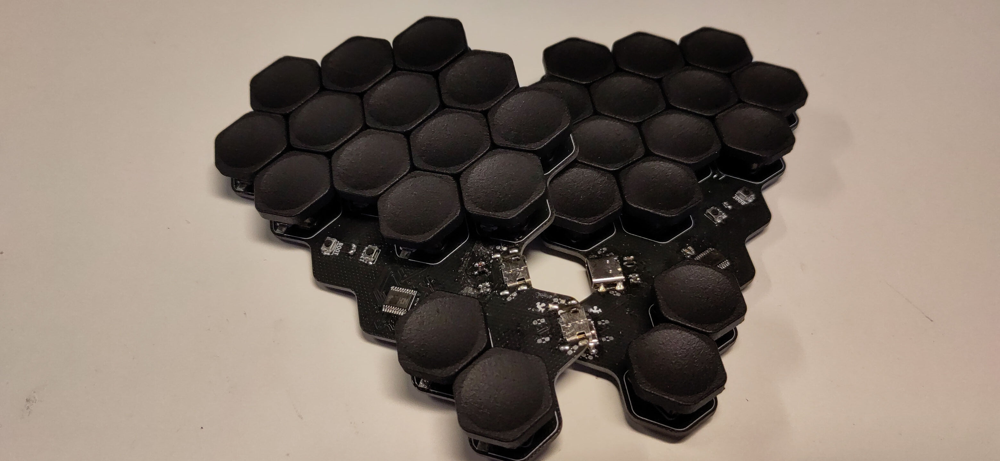
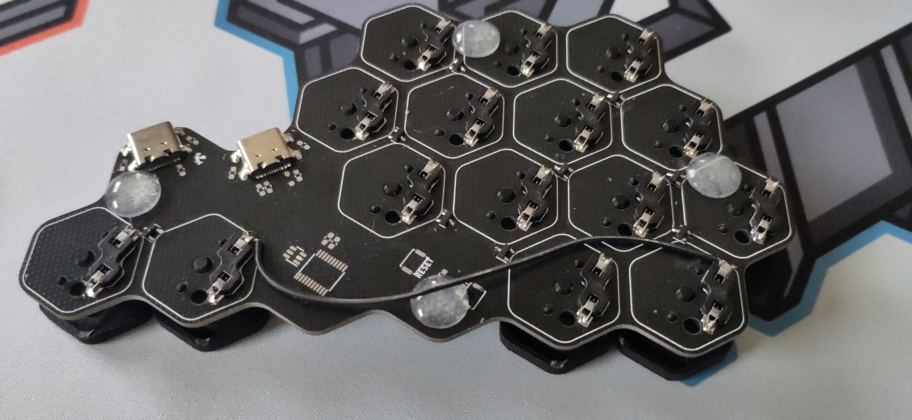

# Hexingbird
Hexingbird is a [hummingbird](https://github.com/PJE66/hummingbird) style split 30 key keyboard designed around [hexagonal keycaps](https://hw.s-ol.nu/HEX-keycaps/), which require Choc v1 switches.
It uses the CH552T controller and [FAK firmware](https://github.com/semickolon/fak).

The electronic design is inspired by the [MIAO MCU board](https://github.com/kilipan/miao) and adapted for split operation.

# BOM
| Part             | LCSC-Part Nr | amount |
|------------------|--------------|--------|
| USB-C            | C223907      | 4      |
| CH552T           | C111367      | 2      |
| BAV70 Diodes     | C727123      | 18     |
| USBLC6-2SC6      | C6807798     | 2      |
| PMEG2010EA       | C193668      | 2      |
| Push buttons     | C115357      | 4      |
| Fuse             | C311055      | 2      |
| 5.1k-Resistor    | C23186       | 4      |
| 10k-Resistor     | C25804       | 2      |
| 1uF-Capacitor    | C2991434     | 4      |
| Hot-Swap-Sockets |              | 30     |
| Choc V1 Switches |              | 30     |

# Buildguide
Before we start let's get our coordinates clear.
The PCB is reversible, but not symmetric when flipped.
You can see this for example with the USB-jack; it's contacts for soldering are only on one side.
I will refer to this side as right top `RT`.
The top side of the right half (`RT`) is equivalent to the bottom side of the left half `LB`.
And vice versa the top side of the left half `LT` is equivalent to the bottom side of right half `RB`.

## Right half
Start with soldering the right half of the keyboard.
This side is easier, as all components (except for the hot-swap sockets) are soldered to the same side, i.e. `RT`.
I advise using a hotplate or hot air to solder the MCU and the USB-jack.
If you are experienced with hand soldering feel free to solder them by hand.
Three components require you to pay attention to the orientation of the component, i.e. the `CH552T`, `USBLC6-2SC6` and `PMEG2010EA`, the latter two are diodes for the ESD-protection.
For the `CH552T` and `USBLC6-2SC6` there are white lines on the PCB, with one line being slightly longer than the other. The side with the extended line is marks the corner in which the dot/dimple of the IC has to be placed.

The next components to solder are the USB-jacks.
After you have successfully soldered the electric pins of the USB-jack, make sure to also solder the metal legs on the side, as they will give stability to the jack.

Now you have completed the hard part, treat yourself with some pads on the shoulder, before we continue with the small two terminal components.
Next to the `CH552T` you will find four pads, these are for the two capacitors.
Next to the top USB-jack you see spots for four components, from top right to bottom left these are the fuse, `PMEG2010EA`-Schottky diode, and two 5.1k Resistors.
The orientation of the diode is important.
The white line on its housing has to face away from the USB-jack.
Another way of orientating the diode is to look closely on the solder-pads of the diode.
One of the pads is shaped like an arrow.
The arrow points towards the white line of the diode.
For the other components the orientation does not matter.

Next solder in the `RESET` and `BOOT` push buttons, as well as the 10k resistor between them.
Finally  install the `BAV70` diodes.

Congratulations, you have now soldered in all the necessary electronic components, you can now flash the firmware (see below) for the central half on this half and test, whether all keys work. All keys except the tucky thumb should work. The tucky thumb requires a bodge wire to function. Will we add the bodge wire, after soldering the hot-swap sockets.

The solder pads above and below the USB-jacks, as well as the pads next to the bottom USB-jack are supposed to be left empty.

## Left half
The left half is a bit more tricky to solder than the right half, as the MCU and the USB-jacks are soldered to different sides of the PCB.
If you are not careful while soldering, the components on the other side might fall off the PCB, or shift around. You don't want either to happen.
One trick to work around this annoyance, is to solder the `CH552T` and `USBLC6-2SC6` to `LT` first, then solder the USB-jacks to `LB`. When soldering the USB-jacks, only put the USB-jack part of the PCB on your hotplate.
If you heat up to much of the PCB, the MCU will fall off the board.

With the USB-jacks, the `CH552T` and the `USBLC6-2SC6` in place, you have completed the hardest part of soldering this keyboard.
From here on it is smooth sailing.
Next solder the `BAV70` diodes to `LB`.
Solder in all the remaining passive components to `LT` just as with the right half.

You can now test the left half by flashing the peripheral firmware onto it, connecting the two keyboard halves with through the USB-jacks with a bird next to them.

After you have confirmed, that all keys except for the tucky thumbs work, it is time to solder in the hot-swap sockets to the bottom sides of the two halves, i.e. the sides without the MCU.

If you are one of the lucky people that got a PCB at Mechanicon 2024 you have to add a bodge wire as shown in the picture, to each half:

# Flashing the firmware
This keyboard is designed for the [FAK-firmware](https://github.com/semickolon/fak).
I've provided some example configuration files in [my fork](https://github.com/ThePurox/fak-config) of the fak-config repository with the keyboard name `hexingbird`.
